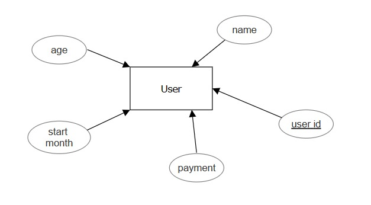
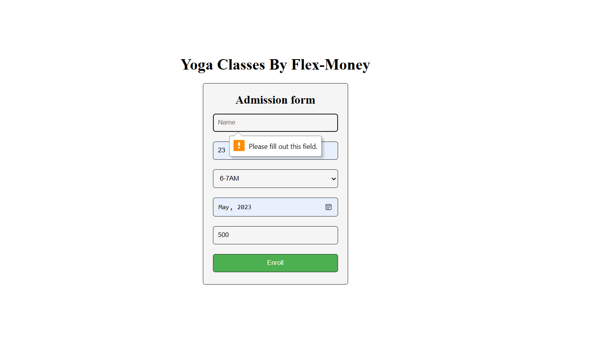
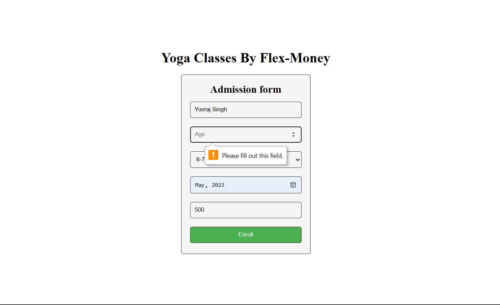
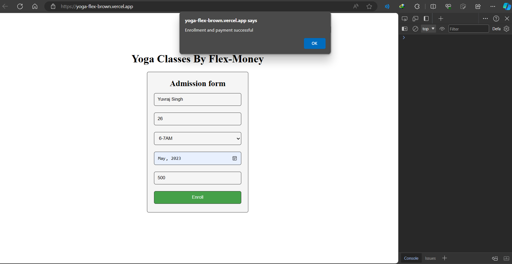
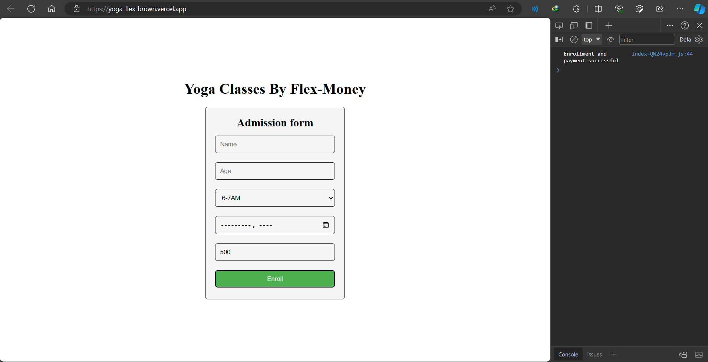
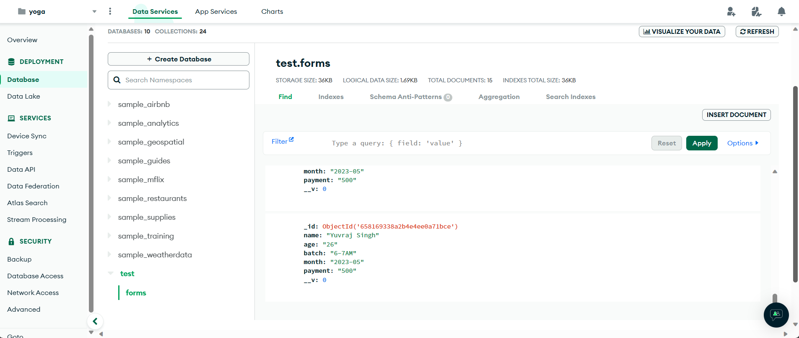

# Yoga Classes Admission Form

This project implements an admission form for Yoga Classes, enabling individuals within the age range of 18-65 to enroll for monthly classes and make payments on a month-to-month basis.

## Features

- **Age Limit:** Participants must be between 18-65 years old to enroll.
- **Monthly Fee:** Fixed at 500/- Rs INR, payable monthly.
- **Batch Selection:** Participants can choose from 4 batches per day (6-7AM, 7-8AM, 8-9AM, 5-6PM) and may switch batches monthly.

## ER Diagram

The ER diagram showcases the database schema and relationships:

   

## Database Schema Design
The database schema is designed based on the following ER diagram:

    +------------------------+
    |       Form             |
    +------------------------+
    | - _id     :   ObjectId |
    | - name    :   String   |
    | - age     :   String   |
    | - batch   :   String   |
    | - month   :   String   | 
    | - payment :   String   |
    +------------------------+

- **Form Table:** Contains participant details such as name, age, selected batch, month, and payment information.

## Approach and Assumptions

### Database Schema
- **Form Table Structure:** The database includes a 'Form' table modeled based on the provided schema with fields for `name`, `age`, `batch`, `month`, and `payment`.
- **Relationships:** No explicit relationships between tables are necessary for this form's functionality.

### Functionality
- **Validation:** Age validation ensures participants are within the specified age range(18-65).
- **Payment Handling:** Simulated payment response is provided upon successful form submission.
- **Error Handling:** Server-side and client-side error handling is implemented for various scenarios.

## Installation and Usage

1. Clone the frontend repository.
2. Clone the backend repository [here](https://github.com/yuvithakur007/yoga-back).
3. Navigate to the project directory.
4. Install dependencies: `npm install`.
5. Start the server: `npm start`.

## Technologies Used

- **Frontend:** React.js
- **Backend:** Node.js, Express.js
- **Database:** MongoDB
- **External Libraries:** Axios, Mongoose, Body-parser, Cors

## Usage

- Access the form by running the application and navigating to the provided URL.
- Fill in participant details, select batch and month, and submit the form.
- Handle payment simulation based on the provided response.

## Testing

### Form Validation

1. **Name Field:**
   - **Test Scenario:** Leave the "Name" field empty.
   - **Expected Result:** An error message should appear, indicating that the "Name" field is required.
   
   

2. **Age Limit:**
   - **Test Scenario:** Enter an age below 18 or above 65.
   - **Expected Result:** An error message should appear, indicating that the age must be between 18 and 65.

    

3. **Payment Field:**
   - **Test Scenario:** Try to modify the "Payment" field (which is read-only).
   - **Expected Result:** The field should remain uneditable.

### Successful Payment

1. **Complete Form Submission:**
   - **Test Scenario:** Fill in all required fields with valid information.
   - **Expected Result:** Upon successful form submission, an alert should appear.

2. **Payment Success Simulation:**
   - **Test Scenario:** Simulate a successful payment response.
   - **Expected Result:** After form submission, the server should respond with a success message indicating both enrollment and payment were successful.

- The success alert will display "Your payment has been processed successfully!"

    
- Show in the console "Enrollment and payment successful"

    

## Database Records

### User Input in Database

1. **Check Stored User Input:**
   - **Test Scenario:** After successfully submitting the form, check the database for the stored user input.
   - **Expected Result:** A screenshot or image should be provided showing the database records with the entered participant details.

   
